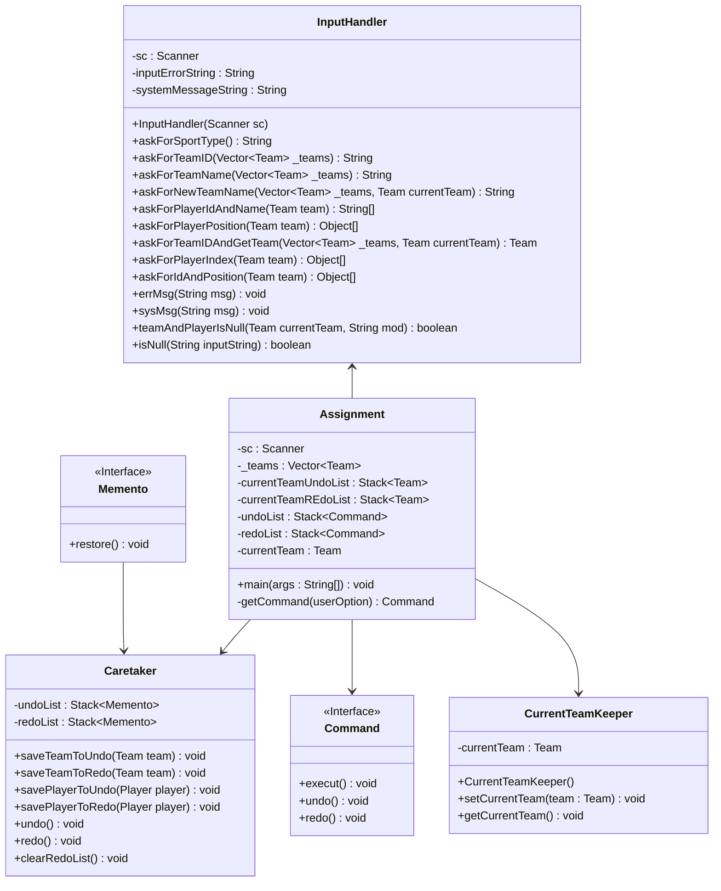
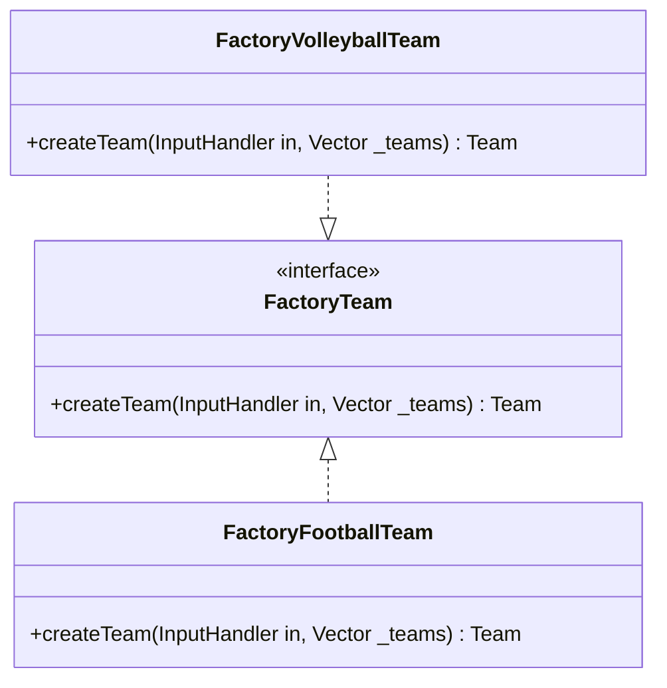
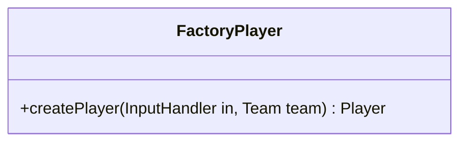
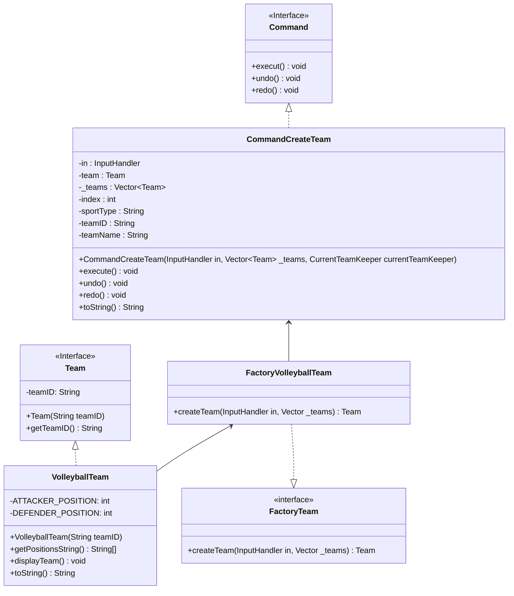
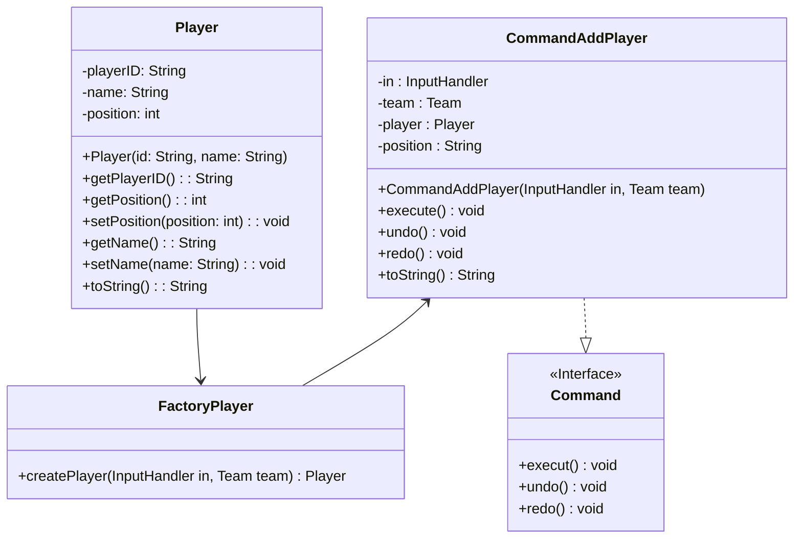
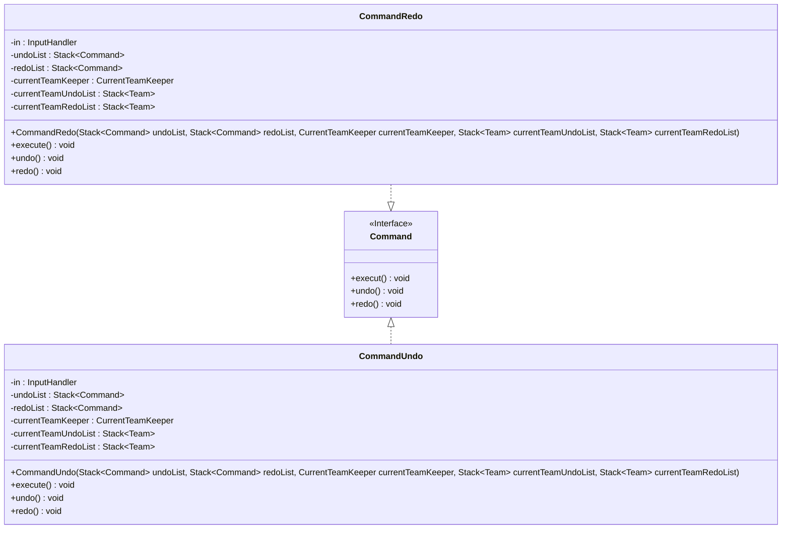
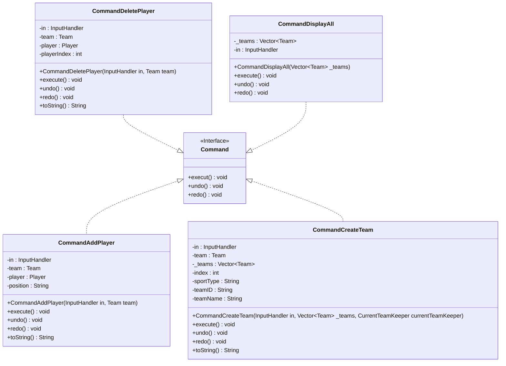
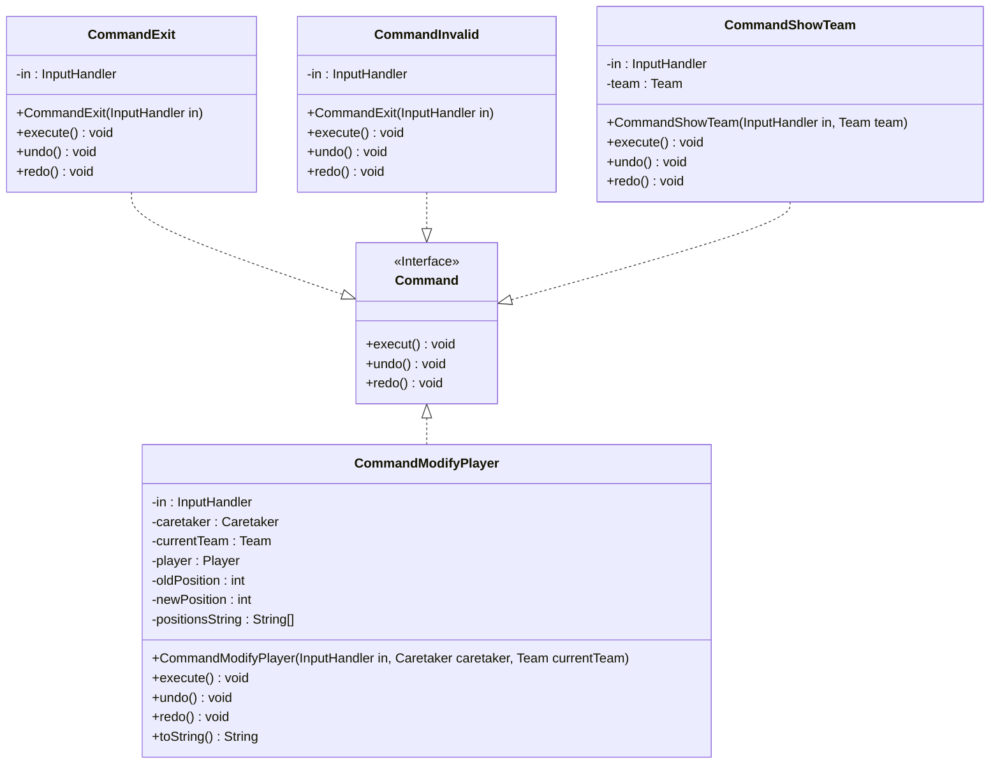
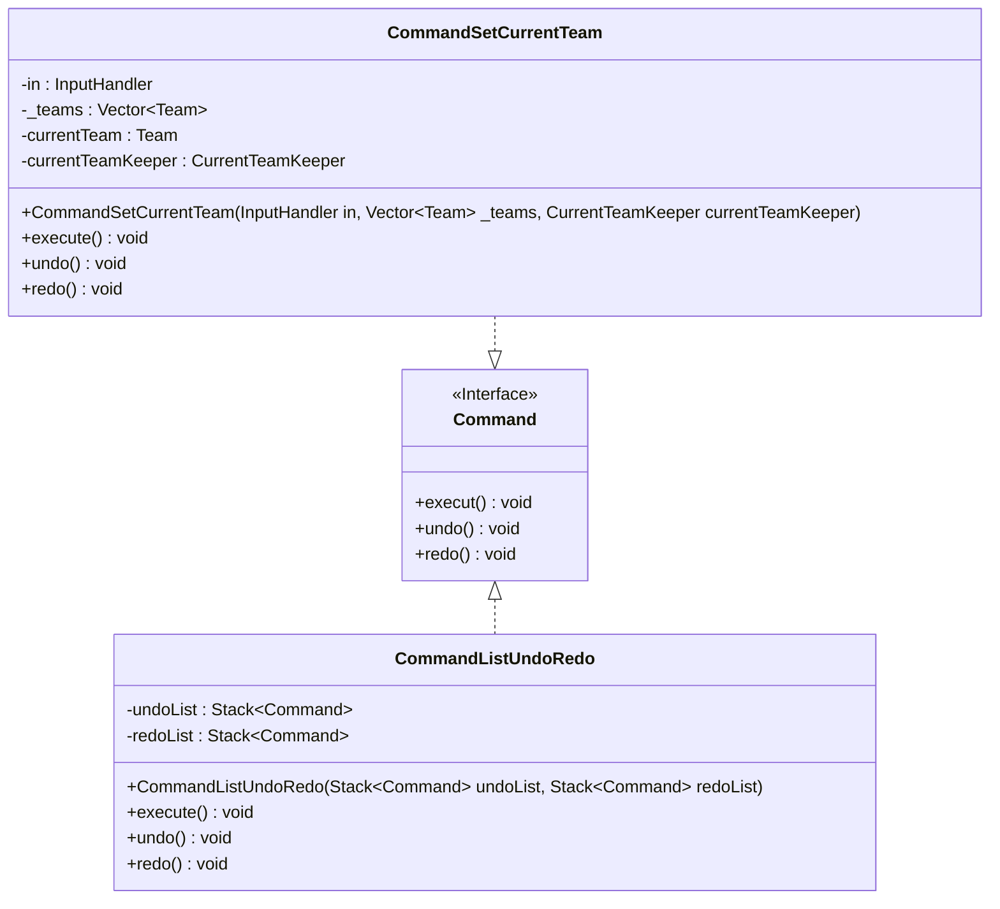
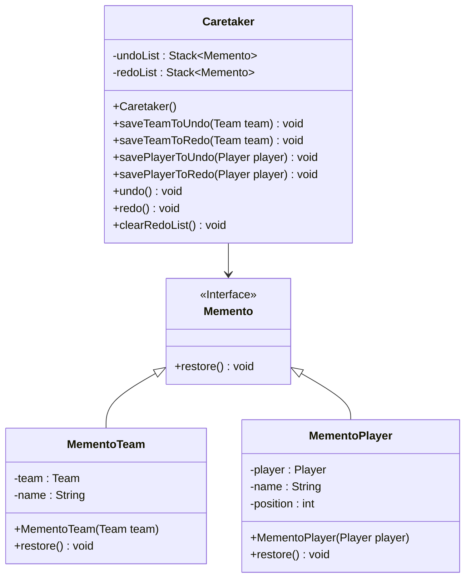

# Class diagram
### Main structure

```mermaid
classDiagram
    class Assignment {
        -sc : Scanner
        -_teams : Vector~Team~
        -currentTeamUndoList : Stack~Team~
        -currentTeamREdoList : Stack~Team~
        -undoList : Stack~Command~
        -redoList : Stack~Command~
        -currentTeam : Team
        +main(args : String[]) void
        -getCommand(userOption) Command
    }
    class Command {
        <<Interface>>
        +execut() void
        +undo() void
        +redo() void
    }
    class Caretaker {
        -undoList : Stack~Memento~
        -redoList : Stack~Memento~
        +saveTeamToUndo(Team team) void
        +saveTeamToRedo(Team team) void
        +savePlayerToUndo(Player player) void
        +savePlayerToRedo(Player player) void
        +undo() void
        +redo() void
        +clearRedoList() void
    }
    class Memento {
        <<Interface>>
        +restore() void
    }
    class InputHandler {
        -sc : Scanner
        -inputErrorString : String
        -systemMessageString : String
        +InputHandler(Scanner sc)
        +askForSportType() String
        +askForTeamID(Vector~Team~ _teams) String
        +askForTeamName(Vector~Team~ _teams) String
        +askForNewTeamName(Vector~Team~ _teams, Team currentTeam) String
        +askForPlayerIdAndName(Team team) String[]
        +askForPlayerPosition(Team team) Object[]
        +askForTeamIDAndGetTeam(Vector~Team~ _teams, Team currentTeam) Team
        +askForPlayerIndex(Team team) Object[]
        +askForIdAndPosition(Team team) Object[]
        +errMsg(String msg) void
        +sysMsg(String msg) void
        +teamAndPlayerIsNull(Team currentTeam, String mod) boolean
        +isNull(String inputString) boolean
    }
    class CurrentTeamKeeper {
        -currentTeam : Team
        +CurrentTeamKeeper()
        +setCurrentTeam(team : Team) void
        +getCurrentTeam() void
    }
    InputHandler <-- Assignment
    Memento --> Caretaker
    Assignment --> Caretaker
    Assignment --> Command
    Assignment --> CurrentTeamKeeper
```

### Factory Pattern

```mermaid
classDiagram
    class FactoryTeam {
        <<interface>>
        +createTeam(InputHandler in, Vector<Team> _teams) Team
    }
    class FactoryVolleyballTeam {
        +createTeam(InputHandler in, Vector<Team> _teams) Team
    }
    class FactoryFootballTeam {
        +createTeam(InputHandler in, Vector<Team> _teams) Team
    }
    FactoryVolleyballTeam ..|> FactoryTeam
    FactoryTeam <|.. FactoryFootballTeam
```

```mermaid
classDiagram
    class FactoryPlayer {
        +createPlayer(InputHandler in, Team team) Player
    }
```

```mermaid
classDiagram
    class FactoryVolleyballTeam {
        +createTeam(InputHandler in, Vector<Team> _teams) Team
    }
    class Command {
        <<Interface>>
        +execut() void
        +undo() void
        +redo() void
    }
    class CommandCreateTeam {
        -in : InputHandler
        -team : Team
        -_teams : Vector~Team~
        -index : int
        -sportType : String
        -teamID : String
        -teamName : String
        +CommandCreateTeam(InputHandler in, Vector~Team~ _teams, CurrentTeamKeeper currentTeamKeeper)
        +execute() void
        +undo() void
        +redo() void
        +toString() String
    }
    class Team {
        <<Interface>>
        -teamID: String
        +Team(String teamID)
        +getTeamID() String
    }
    class VolleyballTeam {
        -ATTACKER_POSITION: int
        -DEFENDER_POSITION: int
        +VolleyballTeam(String teamID)
        +getPositionsString() String[]
        +displayTeam() void
        +toString() String
    }
    class FactoryTeam {
        <<interface>>
        +createTeam(InputHandler in, Vector<Team> _teams) Team
    }
    Team <|.. VolleyballTeam
    FactoryVolleyballTeam <-- VolleyballTeam
    CommandCreateTeam <-- FactoryVolleyballTeam
    Command <|.. CommandCreateTeam
    FactoryVolleyballTeam ..|> FactoryTeam
```

```mermaid
classDiagram
    class FactoryPlayer {
        +createPlayer(InputHandler in, Team team) Player
    }
    class Command {
        <<Interface>>
        +execut() void
        +undo() void
        +redo() void
    }
    class CommandAddPlayer {
        -in : InputHandler
        -team : Team
        -player : Player
        -position : String
        +CommandAddPlayer(InputHandler in, Team team)
        +execute() void
        +undo() void
        +redo() void
        +toString() String
    }
    class Player {
        -playerID: String
        -name: String
        -position: int
        +Player(id: String, name: String)
        +getPlayerID(): String
        +getPosition(): int
        +setPosition(position: int): void
        +getName(): String
        +setName(name: String): void
        +toString(): String
    }
    Player --> FactoryPlayer
    CommandAddPlayer <-- FactoryPlayer
    CommandAddPlayer ..|> Command
```

### Command Pattern

```mermaid
classDiagram
    class Command {
        <<Interface>>
        +execut() void
        +undo() void
        +redo() void
    }
    class CommandRedo {
        -in : InputHandler
        -undoList : Stack~Command~
        -redoList : Stack~Command~
        -currentTeamKeeper : CurrentTeamKeeper
        -currentTeamUndoList : Stack~Team~
        -currentTeamRedoList : Stack~Team~
        +CommandRedo(Stack~Command~ undoList, Stack~Command~ redoList, CurrentTeamKeeper currentTeamKeeper, Stack~Team~ currentTeamUndoList, Stack~Team~ currentTeamRedoList)
        +execute() void
        +undo() void
        +redo() void
    }
    class CommandUndo {
        -in : InputHandler
        -undoList : Stack~Command~
        -redoList : Stack~Command~
        -currentTeamKeeper : CurrentTeamKeeper
        -currentTeamUndoList : Stack~Team~
        -currentTeamRedoList : Stack~Team~
        +CommandUndo(Stack~Command~ undoList, Stack~Command~ redoList, CurrentTeamKeeper currentTeamKeeper, Stack~Team~ currentTeamUndoList, Stack~Team~ currentTeamRedoList)
        +execute() void
        +undo() void
        +redo() void
    }
    CommandRedo ..|> Command
    Command <|.. CommandUndo
```

```mermaid
classDiagram
    class Command {
        <<Interface>>
        +execut() void
        +undo() void
        +redo() void
    }
    class CommandAddPlayer {
        -in : InputHandler
        -team : Team
        -player : Player
        -position : String
        +CommandAddPlayer(InputHandler in, Team team)
        +execute() void
        +undo() void
        +redo() void
        +toString() String
    }
    class CommandCreateTeam {
        -in : InputHandler
        -team : Team
        -_teams : Vector~Team~
        -index : int
        -sportType : String
        -teamID : String
        -teamName : String
        +CommandCreateTeam(InputHandler in, Vector~Team~ _teams, CurrentTeamKeeper currentTeamKeeper)
        +execute() void
        +undo() void
        +redo() void
        +toString() String
    }
    class CommandDeletePlayer {
        -in : InputHandler
        -team : Team
        -player : Player
        -playerIndex : int
        +CommandDeletePlayer(InputHandler in, Team team)
        +execute() void
        +undo() void
        +redo() void
        +toString() String
    }
    class CommandDisplayAll {
        -_teams : Vector~Team~
        -in : InputHandler
        +CommandDisplayAll(Vector~Team~ _teams)
        +execute() void
        +undo() void
        +redo() void
    }
    Command <| .. CommandAddPlayer
    Command <|.. CommandCreateTeam 
    CommandDeletePlayer ..|> Command
    CommandDisplayAll ..|> Command
```

```mermaid
classDiagram
    class Command {
        <<Interface>>
        +execut() void
        +undo() void
        +redo() void
    }
    class CommandExit {
        -in : InputHandler
        +CommandExit(InputHandler in)
        +execute() void
        +undo() void
        +redo() void
    }
    class CommandInvalid {
        -in : InputHandler
        +CommandExit(InputHandler in)
        +execute() void
        +undo() void
        +redo() void
    }
    class CommandModifyPlayer {
        -in : InputHandler
        -caretaker : Caretaker
        -currentTeam : Team
        -player : Player
        -oldPosition : int
        -newPosition : int
        -positionsString : String[]
        +CommandModifyPlayer(InputHandler in, Caretaker caretaker, Team currentTeam)
        +execute() void
        +undo() void
        +redo() void
        +toString() String
    }
    class CommandShowTeam {
        -in : InputHandler
        -team : Team
        +CommandShowTeam(InputHandler in, Team team)
        +execute() void
        +undo() void
        +redo() void
    }
    CommandExit ..|> Command
    CommandInvalid ..|> Command
    CommandShowTeam ..|> Command
    Command <|.. CommandModifyPlayer
```

```mermaid
classDiagram
    class Command {
        <<Interface>>
        +execut() void
        +undo() void
        +redo() void
    }
    class CommandSetCurrentTeam {
        -in : InputHandler
        -_teams : Vector~Team~
        -currentTeam : Team
        -currentTeamKeeper : CurrentTeamKeeper
        +CommandSetCurrentTeam(InputHandler in, Vector~Team~ _teams, CurrentTeamKeeper currentTeamKeeper)
        +execute() void
        +undo() void
        +redo() void
    }
    class CommandListUndoRedo {
        -undoList : Stack~Command~
        -redoList : Stack~Command~
        +CommandListUndoRedo(Stack~Command~ undoList, Stack~Command~ redoList)
        +execute() void
        +undo() void
        +redo() void
    }
    CommandSetCurrentTeam ..|> Command
    Command <|.. CommandListUndoRedo
```

### Memento Pattern

```mermaid
classDiagram
    class Caretaker {
        -undoList : Stack~Memento~
        -redoList : Stack~Memento~
        +Caretaker()
        +saveTeamToUndo(Team team) void
        +saveTeamToRedo(Team team) void
        +savePlayerToUndo(Player player) void
        +savePlayerToRedo(Player player) void
        +undo() void
        +redo() void
        +clearRedoList() void
    }
    class Memento {
        <<Interface>>
        +restore() void
    }
    class MementoTeam {
        -team : Team
        -name : String
        +MementoTeam(Team team)
        +restore() void
    }
    class MementoPlayer {
        -player : Player
        -name : String
        -position : int
        +MementoPlayer(Player player)
        +restore() void
    }
    Caretaker --> Memento
    Memento <|-- MementoTeam
    Memento <|-- MementoPlayer
```

